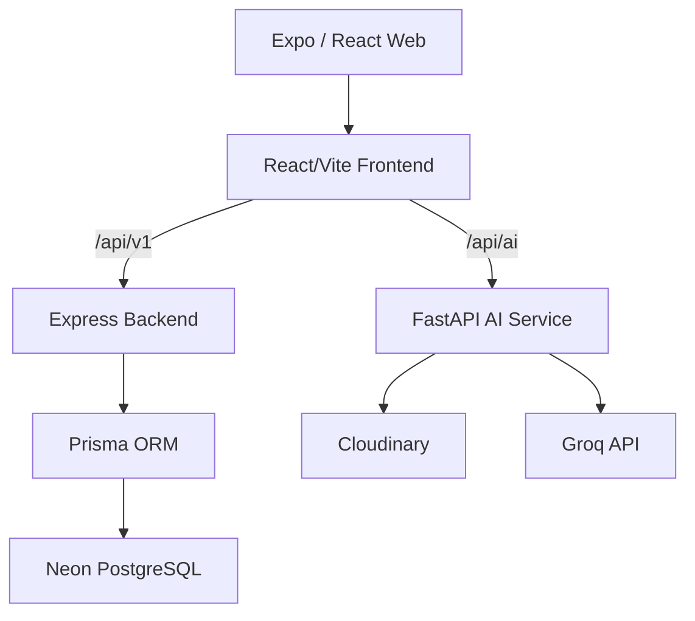

# Simplificant - AI-Driven Digital Marketplace for Artisans

**Problem Statement:** SIH26090

Simplificant helps artisans and micro-entrepreneurs enter digital commerce using AI to remove barriers involving photography, catalog creation, language, and pricing.

---

## 🌟 Core Features

### 1. AI Image Enhancer & Studio
- Automatic background removal
- Lighting correction
- Transforms raw mobile photos into ecommerce-ready product images

### 2. Multilingual Voice-to-Catalog
- Artisans speak naturally in their native language
- Optional typed notes for extra details
- Instant English & Hindi listing generation

### 3. Dynamic Pricing Assistant
- Combines product details, visual analysis, and artisan input
- Generates competitive suggested selling prices based on market trends

### 4. Artisan Marketplace
- Secure Artisan login and authentication
- One-click publishing for AI-generated products
- Backed by PostgreSQL/Neon for reliable storage
- Seamless buyer marketplace with real-time updates
- Comprehensive product details with instant English/Hindi switching

### 5. Ordering
- Secure Buyer login and authentication
- Real database-backed ordering API
- Integrated stock validation and inventory management

---

## 🏗️ Architecture



---

## 📂 Project Structure

- `fullstack-app/`: Contains the React/Vite web application, Expo mobile application, and Express/TypeScript backend.
- `ai-fastapi-service/`: Contains the Python FastAPI service responsible for image enhancement, voice transcription, and catalog generation.
- `docs/`: Architecture documentation.

---

## 🚀 Running Locally

### Prerequisites
- Node.js (v18+)
- Python (3.10+)
- PostgreSQL database (or Neon account)
- Cloudinary account
- Groq API key

### 1. AI FastAPI Service
1. Navigate to the `ai-fastapi-service/` directory.
2. Create your environment configuration:
   ```bash
   cp .env.example .env
   ```
3. Fill in `.env` with your Cloudinary and Groq credentials.
4. Install dependencies:
   ```bash
   pip install -r requirements.txt
   ```
5. Run the server:
   ```bash
   uvicorn main:app --reload --port 8000
   ```

### 2. Fullstack App (Web, Mobile, Backend)
1. Navigate to the `fullstack-app/` directory.
2. Ensure you have copied `.env.example` to `.env` in both `apps/web`, `apps/mobile`, and `services/core-backend` (as applicable) and filled in database details.
3. Install dependencies:
   ```bash
   npm install
   ```
4. Push Prisma schema to your database:
   ```bash
   cd services/core-backend
   npx prisma db push
   cd ../..
   ```
5. Start the monorepo dev servers:
   ```bash
   npm run dev
   ```

---

## 🎥 Demo & Links

- **YouTube Demo:** <ADD_YOUTUBE_LINK>
- **Google Drive Submission:** <ADD_DRIVE_LINK>
